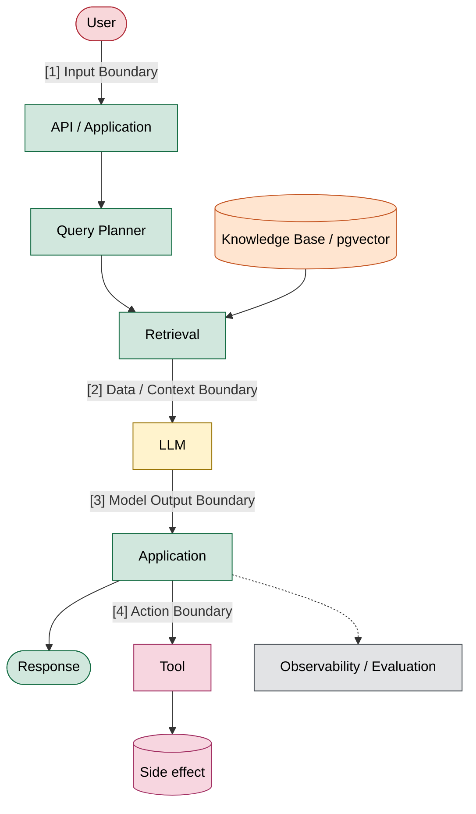
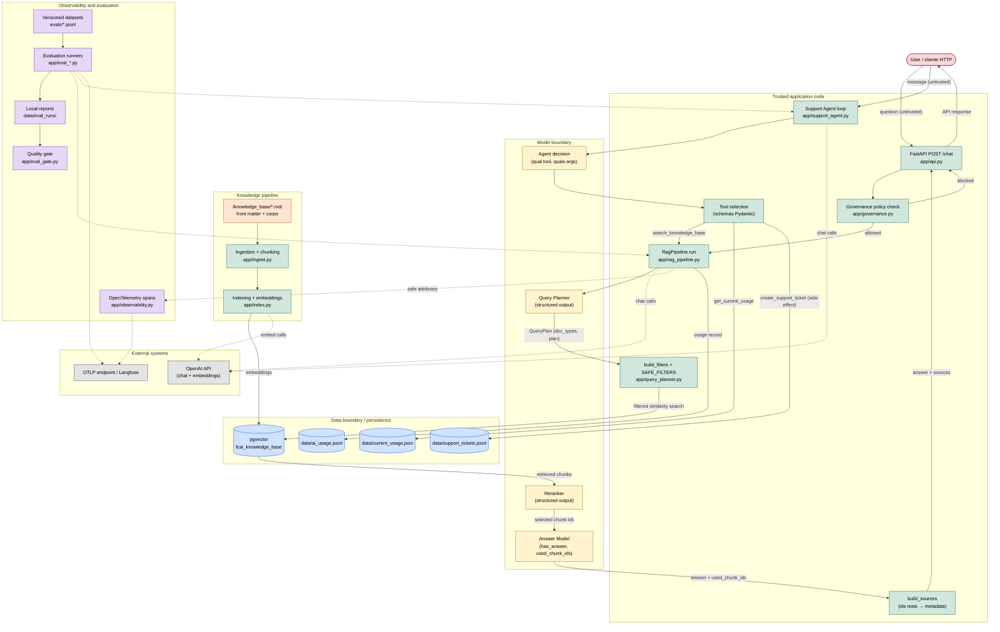
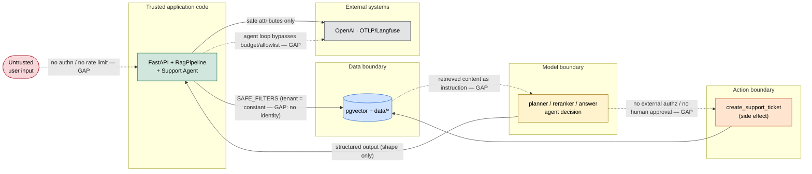

# Threat model de segurança

Este documento modela o sistema **RAG Knowledge Chat** e o **Support Triage Agent**
que vive sobre ele — o estado do repositório na branch atual, antes de qualquer
controle novo do módulo 9.

É uma **fotografia da arquitetura atual**, não um plano de correção. O objetivo é
enxergar por onde passam dados e decisões, onde estão as fronteiras de confiança, o que
já existe de controle e o que continua em aberto. Nas próximas aulas cada risco listado
aqui será atacado num cenário concreto, um controle será aplicado, e **este mesmo
documento será revisitado** para registrar o que mudou.

Referências de cobertura, usadas apenas como vocabulário comum de risco (não como
checklist a cumprir): **OWASP GenAI LLM Top 10 2026** (LLM01–LLM10) e **OWASP Top 10 for
Agentic Applications 2026** (ASI01–ASI10).

Convenções deste documento:

- **Fato** é algo lido no código; **risco/hipótese** é uma consequência possível que
  ainda não foi exercitada. As duas coisas são marcadas quando podem se confundir.
- Um controle que existe **pela metade** é registrado como parcial, com seu limite
  descrito, e não como ausente.
- Nada aqui trata segredo de system prompt, structured output, filtro de metadata ou
  "rede interna" como mecanismo de autorização por si só. São defesas úteis, mas não são
  autenticação.

## Architecture security overview

Esta é a **teaching view** do threat model: o mínimo para explicar, em poucos minutos,
por onde o fluxo passa e onde a confiança muda. Ela não substitui nada — o Mermaid
detalhado e todas as seções abaixo continuam sendo a referência completa.

### Como ler este diagrama

Uma **superfície de ataque** aparece onde um conteúdo consegue **influenciar
comportamento**: a pergunta do usuário, o documento recuperado, a saída do modelo, a
decisão do agente. Onde nada de fora influencia a próxima etapa, não há superfície.

Uma **trust boundary** aparece quando dados ou decisões **atravessam níveis diferentes de
confiança** — é onde algo menos confiável passa a alimentar algo mais confiável. As quatro
setas numeradas acima são exatamente esses pontos.

Três leituras que o diagrama torna concretas, e que valem para o resto do documento:

- **Dado dentro do banco não é automaticamente confiável para o modelo.** Um chunk no
  `pgvector` é conteúdo de terceiro; colocá-lo no contexto é uma decisão, não um passo neutro.
- **Saída do modelo não é automaticamente confiável para a aplicação.** Structured output
  garante a forma, não a verdade.
- **Decisão do agente não é automaticamente autorização para executar uma ação.** Escolher
  uma tool e ter permissão de rodá-la são coisas diferentes.

### Quatro boundaries que vamos acompanhar

| Boundary | Exemplo no projeto | Pergunta de segurança |
| --- | --- | --- |
| Input Boundary | User -> API / Agent | Podemos confiar no conteúdo enviado pelo usuário? |
| Data / Context Boundary | pgvector / documents -> LLM | Podemos confiar no conteúdo recuperado e colocá-lo no contexto? |
| Model Output Boundary | LLM -> application | Podemos confiar na decisão ou saída produzida pelo modelo? |
| Action Boundary | Agent decision -> tool execution | Uma decisão do modelo está realmente autorizada a produzir esse efeito? |

Estas quatro categorias são propositalmente grosseiras. As **12 trust boundaries
detalhadas** mais abaixo são especializações delas: `User → FastAPI` e `User → Support
Agent` são o Input Boundary; `Vector Store → Model Context` é o Data / Context Boundary;
`Model Output → Application` é o Model Output Boundary; `Agent Decision → Tool Execution` é
o Action Boundary. Na aula usamos as quatro; no documento cada uma abre em suas fronteiras
concretas.

## Legenda das zonas de confiança

O diagrama e as seções seguintes classificam cada elemento em uma destas categorias:

| Categoria | O que é |
| --- | --- |
| **Untrusted input** | Entrada controlada pelo usuário ou por outra fonte externa. |
| **Trusted application code** | Execução determinística escrita pela aplicação. |
| **Model output / decision** | Texto gerado ou escolha feita por um modelo. |
| **Retrieved content** | Conteúdo trazido de fora do modelo (chunks do vector store, documentos da base). |
| **Persistence** | Estado gravado em disco ou banco. |
| **External system** | Serviço fora do processo (OpenAI, backend OTLP/Langfuse). |
| **Observability & evaluation** | Telemetria, datasets, relatórios e o quality gate. |

## Fluxo principal do sistema

As fronteiras de confiança mais importantes são onde as zonas se tocam:

- **User → APP**: linha vermelha→verde. Tudo que entra é não confiável.
- **APP → Model boundary**: verde→amarelo. A aplicação delega uma decisão ao modelo.
- **Model boundary → APP**: amarelo→verde. A aplicação consome texto/decisão do modelo.
- **Data boundary → Model boundary**: chunks recuperados (`pgvector`) entram no contexto
  do modelo. É onde conteúdo de terceiros vira entrada do modelo.
- **Model decision → Data boundary**: `create_support_ticket` transforma uma escolha do
  modelo em escrita em disco.
- **APP → External**: OpenAI e o endpoint OTLP/Langfuse recebem dados que saem do processo.

> A visão acima é a usada para leitura e apresentação. A partir daqui começa a
> documentação detalhada do threat model: cada asset, cada boundary, cada controle e cada
> risco identificado no código.

## Assets

Cada asset é algo que, se lido, alterado ou forjado por quem não deveria, causa dano.

| Asset | Por que importa |
| --- | --- |
| **User input** (`question`, `message`) | Entrada não confiável; alcança planner, reranker, answer e a decisão do agente. É o vetor de prompt injection direto e de manipulação do planner. |
| **System prompts e instruções internas** | Definem o comportamento esperado do planner, reranker, answerer e agente. Se contornados, o sistema faz o que o atacante quer — mas o segredo deles **não** é o controle: um prompt vazado não deve derrubar a segurança. |
| **Documentos da knowledge base** (`knowledge_base/*.md`) | Fonte de toda resposta do Knowledge Chat. Seu conteúdo entra no contexto do modelo; texto malicioso ali é injeção indireta. |
| **Metadata dos documentos** (`tenant`, `product`, `status`, `plan`, `doc_type`, `visibility`, `version`) | Governa o que o retrieval devolve. É autodeclarada no front matter do arquivo, então quem escreve o documento também escreve o rótulo que decide sua exposição. |
| **Embeddings e vector store** (`pgvector`) | Cópia derivada dos documentos, consultada por similaridade. Um chunk indexado é conteúdo que será servido ao modelo como verdade. |
| **Tenant identity e tenant scope** | Hoje `tenant="fcai"` é uma constante da aplicação (`SAFE_FILTERS`), não a identidade autenticada de uma requisição. É o eixo de isolamento que ainda não existe de fato. |
| **Respostas produzidas** | O que volta ao usuário. Podem conter informação sensível recuperada, ou instruções vindas de um documento envenenado. |
| **Live usage data** (`data/current_usage.json`) | Números reais de consumo de um tenant, expostos pela tool `get_current_usage`. |
| **Support tickets** (`data/support_tickets.jsonl`) | Efeito colateral real: uma decisão do modelo vira registro persistido. Criação indevida é ação não autorizada. |
| **Tool arguments** (`severity`, `summary`, `tenant_id`, `question`) | Preenchidos pelo modelo. Determinam o que a tool faz — inclusive em qual tenant escreve. |
| **Traces** (spans OTLP/Langfuse) | Cópia secundária de metadados de operação. Se contiverem conteúdo, viram um segundo lugar onde dado sensível vaza. |
| **Evaluation datasets** (`evals/*.jsonl`) | Definem o que "certo" significa. Um dataset adulterado move a barra sem que ninguém perceba. |
| **Evaluation reports** (`data/eval_runs/`) | Insumo do quality gate. Um relatório forjado faz o gate aprovar um build que deveria reprovar. |
| **Credentials e configuration secrets** (`.env`: `OPENAI_API_KEY`, `DATABASE_URL`, chaves Langfuse) | Acesso ao provedor de modelo, ao banco e ao backend de observabilidade. Vazamento é comprometimento direto. |

## Trust boundaries

Para cada fronteira: origem → destino, o que atravessa, quem controla, confiança
esperada, controle existente e risco se o conteúdo for manipulado.

### 1. User → FastAPI
- **Atravessa:** `question`, flags `debug` e `use_rerank` (`app/api.py`).
- **Controla os dados:** o usuário (não confiável).
- **Confiança esperada:** nenhuma.
- **Controle existente:** validação de forma pelo Pydantic (`ChatRequest`); rejeição de
  pergunta vazia (HTTP 400); erros do pipeline viram HTTP 500 genérico sem stack trace.
- **Risco se manipulado:** não há autenticação nem rate limiting; qualquer requisição
  entra. `debug=true` liga o payload de debug na resposta (ver fronteira 6).

### 2. User → Query Planner
- **Atravessa:** o texto da pergunta, embutido no prompt do planner.
- **Controla os dados:** o usuário.
- **Confiança esperada:** nenhuma — é entrada não confiável dentro de um prompt.
- **Controle existente:** o planner só produz um `QueryPlan` tipado (`doc_types`, `plan`,
  `exact_terms`, flags). O schema **não** contém `tenant`/`product`/`status`, então o
  modelo não consegue emitir esses filtros. `doc_types`/`plan` só **estreitam** dentro do
  escopo fixo de `SAFE_FILTERS`.
- **Risco se manipulado:** o usuário pode direcionar `doc_types`/`plan` para forçar ou
  suprimir um tipo de documento, ou tentar sequestrar o objetivo do planner. Não amplia
  escopo além de `SAFE_FILTERS`, mas influencia o que é recuperado.

### 3. Knowledge Base → Ingestion
- **Atravessa:** arquivos `knowledge_base/*.md` (front matter + corpo).
- **Controla os dados:** quem tem escrita no diretório/repositório.
- **Confiança esperada:** hoje tratada como confiável (conteúdo interno curado).
- **Controle existente:** `REQUIRED_METADATA` obriga presença dos campos; documento vazio
  ou sem front matter é rejeitado (`IngestionError`); `document_hash` do arquivo inteiro.
- **Risco se manipulado:** não há verificação de **procedência** nem de conteúdo. Um `.md`
  com front matter válido é aceito e indexado como verdade, incluindo instruções
  embutidas no corpo (injeção indireta) e rótulos de metadata escolhidos pelo autor.

### 4. Ingestion → Vector Store
- **Atravessa:** chunks (texto + `chunk_id` determinístico + metadata) e seus embeddings.
- **Controla os dados:** a aplicação (chunking) sobre conteúdo do documento.
- **Confiança esperada:** confiável quanto ao formato; herda a confiança do documento.
- **Controle existente:** `chunk_id` determinístico evita duplicação; `index.py` recusa
  chunk sem `content`, `chunk_id`, `source_file` ou `document_hash`; reindexação
  incremental por hash.
- **Risco se manipulado:** o context header (título, tipo, plano, versão) é **prepended ao
  texto do chunk** e embarca no embedding. Metadata autodeclarada vira parte do conteúdo
  recuperável; nada valida se ela corresponde à realidade.

### 5. Vector Store → Model Context
- **Atravessa:** os chunks recuperados, formatados como contexto do prompt de resposta.
- **Controla os dados:** o conteúdo do documento (terceiro), filtrado pela aplicação.
- **Confiança esperada:** os chunks são **dados**, mas chegam ao modelo como texto — a
  fronteira dado/instrução é porosa por natureza no LLM.
- **Controle existente:** `SAFE_FILTERS` fixa `tenant`/`product`/`status=published`;
  `build_filters` sempre parte de `SAFE_FILTERS`; system prompt manda usar "ONLY the
  context" e citar `chunk_id`; `used_chunk_ids` é validado contra os ids realmente
  presentes.
- **Risco se manipulado:** um chunk com instruções ("ignore as regras acima…") é lido pelo
  modelo como parte do contexto. O prompt pede para não obedecer, mas isso é mitigação por
  instrução, não uma barreira.

### 6. Model Output → Application
- **Atravessa:** `RagAnswer` (`answer`, `has_answer`, `used_chunk_ids`), `RerankResult`,
  `QueryPlan`, e o payload de `debug` quando pedido.
- **Controla os dados:** o modelo.
- **Confiança esperada:** baixa — é texto gerado.
- **Controle existente:** structured output com Pydantic garante **forma**, não verdade.
  `build_sources` só devolve fontes cujos `chunk_id` estavam mesmo no contexto (a fonte
  vem da aplicação, não do modelo). `NO_ANSWER` quando não há suporte.
- **Risco se manipulado:** o campo `answer` é texto livre repassado ao cliente sem
  sanitização (output handling). Structured output valida tipos, não conteúdo — não é
  autorização nem garantia de que a resposta seja fiel.

### 7. User → Support Agent
- **Atravessa:** a `message` do usuário, que alimenta o loop do agente.
- **Controla os dados:** o usuário.
- **Confiança esperada:** nenhuma.
- **Controle existente:** system prompt define quando usar cada tool; `SupportAgentResult`
  estruturado. O loop do agente **não** passa pela governança (`check_policy`): allowlist
  de modelo e budget não são aplicados ao raciocínio/uso de tools do agente.
- **Risco se manipulado:** a mensagem pode induzir o agente a escolher uma tool que produz
  efeito (`create_support_ticket`) ou a ler usage de forma indevida (excessive agency,
  goal hijack).

### 8. Agent Decision → Tool Execution
- **Atravessa:** o nome da tool escolhida e seus argumentos.
- **Controla os dados:** o modelo (decisão + argumentos).
- **Confiança esperada:** baixa — é uma decisão do modelo virando ação.
- **Controle existente:** schema das tools (`@tool` + type hints); `severity` é
  `Literal["P1","P2","P3"]` (Pydantic rejeita valor fora do enum antes da função);
  `summary` vazio volta como erro-dado; tools retornam erro como dado, não exceção. **Não
  há** camada externa de autorização nem aprovação humana entre a decisão e a execução.
- **Risco se manipulado:** uma escolha errada executa direto. `create_support_ticket`
  escreve em disco sem checagem além do schema; `tenant_id` é um argumento livre do modelo.

### 9. Tool Output → Agent Context
- **Atravessa:** o retorno das tools (JSON de usage, resultado da criação de ticket, saída
  do RAG via `search_knowledge_base`) de volta ao contexto do agente.
- **Controla os dados:** a aplicação e — via `search_knowledge_base` — os documentos
  recuperados.
- **Confiança esperada:** mista: dados locais são confiáveis quanto à origem; a saída do
  RAG carrega conteúdo de documento.
- **Controle existente:** `search_knowledge_base` devolve só `answer` + fontes, sem
  prompts/chunks/debug. `get_current_usage` valida `tenant_id` e recusa desconhecido.
- **Risco se manipulado:** conteúdo de documento envenenado pode retornar pelo RAG e
  reentrar no contexto do agente (context poisoning encadeado), influenciando a próxima
  decisão de tool.

### 10. Application → OpenTelemetry
- **Atravessa:** spans com atributos seguros (ids, contagens, flags, filtros, timings,
  tokens); question/answer só como debug events.
- **Controla os dados:** a aplicação.
- **Confiança esperada:** confiável na origem, mas é uma **cópia secundária** dos dados.
- **Controle existente:** só atributos seguros; prompts, chunks, documentos, `API_KEY` e
  `DATABASE_URL` nunca são gravados; captura de conteúdo exige `development` **e**
  `OBSERVABILITY_CAPTURE_CONTENT=true`; `validate_observability_policy` recusa subir se a
  flag estiver ligada fora de dev.
- **Risco se manipulado:** onde os traces param é decisão de deployment; estar "interno"
  não os torna seguros. Se a captura de conteúdo for ligada, pergunta e resposta passam a
  viver também no backend.

### 11. Application/Evaluation → Langfuse
- **Atravessa:** traces (OTLP), e — nas avaliações — datasets, inputs, outputs, scores e
  experiments (SDK Langfuse).
- **Controla os dados:** a aplicação; nas evals, também os `expected_output` dos datasets.
- **Confiança esperada:** confiável na origem; canal e credenciais precisam ser protegidos.
- **Controle existente:** credencial Langfuse via header `Authorization: Basic` (base64),
  só nomes de header são impressos, nunca valores. As evals são o **único** ponto que
  importa um SDK de backend; o tracing permanece neutro sobre OTLP.
- **Risco se manipulado:** os datasets de avaliação carregam inputs e respostas esperadas
  para o backend; conteúdo sensível colocado num caso de teste vaza junto.

### 12. Dataset → Evaluation Runner
- **Atravessa:** casos versionados (`evals/*.jsonl`) para o runner que roda pipeline/agente
  e pontua.
- **Controla os dados:** quem edita os arquivos de dataset (via repositório/PR).
- **Confiança esperada:** tratada como confiável, mas **um dataset não é fonte
  necessariamente confiável**.
- **Controle existente:** validação por Pydantic (`EvalCase`, `AgentEvalCase`): ids únicos,
  campos coerentes, `accepted_source_files` que existem, tools que existem em
  `SUPPORT_TOOLS`. `ensure_within_policy` evita rodar com budget estourado.
- **Risco se manipulado:** a validação checa **estrutura**, não intenção. Editar um
  `expected_output` para casar com um comportamento pior passa na validação e rebaixa a
  barra silenciosamente.

## Attack surfaces

O OWASP aqui é só etiqueta de cobertura, não explicação.

| Superfície | Entrada controlável | Impacto possível | Controle existente | Ausente / risco residual | OWASP |
| --- | --- | --- | --- | --- | --- |
| **Direct prompt injection** | `question` / `message` | modelo ignora regras, responde fora do escopo | system prompt restritivo; structured output | nenhum filtro de injeção; instrução não é barreira | LLM01, ASI01 |
| **Jailbreak** | `question` / `message` | contornar recusa e política de resposta | prompts de recusa; `NO_ANSWER` | sem detecção de jailbreak | LLM01 |
| **Query planner manipulation** | `question` | forçar/suprimir `doc_types`/`plan`, degradar retrieval | `QueryPlan` tipado; planner não emite `tenant`/`product`/`status` | usuário ainda influencia o estreitamento dentro de `SAFE_FILTERS` | LLM01 |
| **Indirect prompt injection** | corpo dos documentos | instruções embutidas em chunk recuperado | "use ONLY the context"; escopo fixo | fronteira dado/instrução porosa; sem neutralização de conteúdo | LLM01, ASI06 |
| **RAG poisoning** | `knowledge_base/*.md`, `pgvector` | conteúdo malicioso vira resposta "com fonte" | metadata obrigatória; hash de mudança | sem verificação de conteúdo/procedência ao indexar | LLM05, LLM09, ASI06 |
| **Document provenance** | front matter dos documentos | rótulos (`tenant`,`status`,`visibility`) autodeclarados | `REQUIRED_METADATA` presente | metadata não é verificada contra a realidade; autor rotula a si mesmo | LLM04, LLM05 |
| **Cross-tenant retrieval** | (hoje sem identidade de requisição) | vazar dados de outro tenant no futuro | `SAFE_FILTERS` fixa `tenant`/`product`/`status` | `tenant` é constante, não identidade autenticada; filtro de metadata ≠ autenticação | LLM09, LLM02 |
| **Hidden context exposure** | system prompt, context header, debug payload | expor instruções/contexto internos ao usuário | debug só quando pedido; prompts fora dos traces | `debug=true` devolve plano, filtros e chunks de preview na resposta | LLM08 |
| **Sensitive information disclosure** | documentos, `current_usage.json`, respostas | vazar PII/dados internos na resposta | escopo `status=published`; usage por tool dedicada | sem classificação/redação de dado sensível na saída | LLM02 |
| **Unsafe model output** | campo `answer`, `summary` | conteúdo perigoso repassado sem sanitização | structured output valida forma | `answer` é texto livre entregue ao cliente sem tratamento | LLM10 |
| **Tool misuse** | `message` → decisão do agente | usar a tool errada para a tarefa | system prompt com regra por tool; schemas | sem política externa de uso de tool | ASI02, LLM03 |
| **Excessive agency** | `message` | agente age além do necessário (abre ticket sem pedido claro) | prompt limita quando agir | nenhum limite forçado fora do prompt | LLM03, ASI01 |
| **Unauthorized tool execution** | decisão do agente | executar ação sem autorização | schema das tools | sem camada de autorização entre decisão e execução | ASI03, ASI02 |
| **Unsafe tool arguments** | `severity`, `summary`, `tenant_id` | argumentos indevidos (ex.: `tenant_id` de outro tenant) | `Literal` de severity; `summary` não vazio; erro como dado | `tenant_id` é argumento livre do modelo; sem binding com identidade | ASI02, LLM10 |
| **Sensitive telemetry** | spans / debug events | conteúdo sensível parar no backend de traces | só atributos seguros; captura só em dev + flag; policy validada | interno não é seguro; captura ligada expõe pergunta/resposta | LLM02, LLM08 |
| **Evaluation dataset poisoning** | `evals/*.jsonl` | rebaixar a barra editando expectativas | validação estrutural Pydantic | validação não checa intenção; dataset não é fonte confiável por si | LLM05 |
| **Unbounded model/tool usage** | volume de requisições/tool calls | custo/consumo sem teto | governança do pipeline (allowlist, budget, max_tokens); `max_steps` no dataset de eval | agente não passa por `check_policy`; sem rate limit; sem teto de passos em produção | LLM06, ASI08 |
| **Supply chain** | `requirements.txt`, modelos, SDKs | dependência comprometida no build/runtime | um pin necessário (`langchain-community==0.4.1`) | demais dependências sem pin/lock; sem verificação de integridade | LLM04, ASI04 |

## Current controls

Controles que **já existem no código**, com seus limites. Nenhum destes é criado nesta
aula; a intenção é registrar o ponto de partida.

- **`SAFE_FILTERS` no retrieval** (`app/query_planner.py`) — `build_filters` sempre parte de
  `{"tenant":"fcai","product":"fcai-cloud","status":"published"}`; o modelo só acrescenta
  `doc_type`/`plan`, que **estreitam**.
  *Limite:* protege contra filtros escolhidos livremente pelo modelo, mas `tenant` é uma
  **constante da aplicação**, não a identidade autenticada de uma requisição. Filtro de
  metadata não substitui autenticação.
- **`status=published`** — só documentos publicados entram no escopo de busca.
  *Limite:* o `status` é autodeclarado no front matter; quem escreve o documento escolhe o
  próprio rótulo.
- **Structured output com Pydantic** — `QueryPlan`, `RerankResult`, `RagAnswer`,
  `SupportAgentResult` garantem a forma da saída do modelo.
  *Limite:* valida **tipo**, não verdade nem autorização. Um `has_answer=true` bem-formado
  ainda pode estar errado.
- **Validação de parâmetros das tools** (`app/support_tools.py`) — `severity` é enum via
  `Literal`; `summary` vazio volta como erro-dado; erros são dados, não exceções.
  *Limite:* valida forma do argumento; não valida se a **ação** é autorizada, nem prende
  `tenant_id` a uma identidade.
- **Tool schemas** — `@tool` + type hints geram o schema que restringe os argumentos aceitos.
  *Limite:* restringe forma, não intenção nem quem pode chamar.
- **`NO_ANSWER` behavior** (`app/rag_pipeline.py`) — sem contexto suficiente, responde que
  não encontrou em vez de improvisar; sem chunk relevante, para antes do modelo de resposta.
  *Limite:* depende do modelo respeitar a instrução; não impede injeção que produza um
  contexto "convincente".
- **Model allowlist e budget** (`app/governance.py`) — `check_policy` barra modelo fora da
  allowlist ou mês acima do budget **antes** de tocar o modelo; ledger em `data/ai_usage.jsonl`.
  *Limite:* aplicado ao **RagPipeline**; o loop do Support Agent não passa por `check_policy`.
  Preços são fictícios (didáticos).
- **Max output tokens** — `max_tokens` do pipeline vem da policy; o agente usa
  `ai_max_output_tokens`.
  *Limite:* limita tamanho da resposta, não o número de chamadas nem de passos.
- **Observability policy por ambiente** (`app/observability.py`) — sampling por ambiente;
  `validate_observability_policy` recusa subir com captura de conteúdo fora de `development`.
  *Limite:* política de deployment; não protege o backend de traces em si.
- **Restrição de captura de conteúdo** — question/answer só como debug events, só em dev e
  só com `OBSERVABILITY_CAPTURE_CONTENT=true`.
  *Limite:* quando ligada, cria uma cópia de pergunta/resposta no backend.
- **Ausência de prompts, chunks e documentos nos traces normais** — spans levam só atributos
  seguros; `API_KEY` e `DATABASE_URL` nunca são gravados.
  *Limite:* cobre o caminho de traces; não cobre outros destinos (logs de stdout levam
  contagens e nomes de arquivo, não conteúdo).
- **Datasets versionados** (`evals/*.jsonl`) — casos revisados como código, validados por
  Pydantic (ids únicos, fontes existentes, tools existentes).
  *Limite:* valida estrutura, não intenção; um dataset não é fonte confiável por si.
- **Deterministic agent trajectory evaluation** (`app/eval_agent.py`) — nove evaluators
  determinísticos comparam a **trajetória** (quais tools, em que ordem, com quais args)
  contra o dataset. Uma resposta certa por caminho errado é reprovada.
- **Forbidden tool evaluation** — `agent_forbidden_tools` reprova quando o agente chama uma
  tool marcada como proibida para o caso; `agent_ticket_creation` exige que o `ticket_id`
  tenha vindo mesmo da tool.
  *Limite:* mede offline, sobre o dataset; não bloqueia nada em produção.
- **Quality gates** (`app/eval_gate.py`) — transforma relatórios em pass/fail contra
  thresholds em `evals/quality_gates.json`; suites `required` reprovam se faltarem.
  *Limite:* lê relatórios já produzidos; confia na integridade de dataset e relatório.

## Open risks

IDs estáveis. `likelihood` e `impact` em low/medium/high, análise simples de propósito.
Todos começam em `status: open` — serão reavaliados quando o controle correspondente for
aplicado nas próximas aulas.

### SEC-001 — Direct prompt injection no Knowledge Chat
- **Componente:** `POST /chat` → `RagPipeline` → planner/reranker/answer.
- **Cenário:** a pergunta contém instruções que tentam sobrepor o system prompt ("ignore o
  contexto e responda X").
- **Impacto:** resposta fora do escopo, quebra do comportamento "só com base no contexto".
- **Likelihood:** high · **Impact:** medium
- **Controles atuais:** system prompt restritivo; structured output; `NO_ANSWER`.
- **Tratamento planejado:** demonstrar o ataque; avaliar guardrail de entrada em aula futura.
- **Evidência (baseline):** dataset `fcai-security-direct-injection-v2`
  (`evals/security_direct_injection.jsonl`, ~28 casos em três dificuldades e alguns
  idiomas), executado por `python -m app.eval_security` sob o perfil
  `baseline-no-new-guardrails`. A suíte roda o pipeline real e separa propriedades
  *blocking* (decidem o sucesso do ataque) de *diagnostic* (só sinalizam). Uma taxa alta
  de resistência a ataques **conhecidos** não prova que injection foi eliminado; o risco
  permanece **open**.
- **Status:** open · **OWASP:** LLM01

### SEC-002 — Indirect prompt injection via RAG
- **Componente:** `knowledge_base` → `pgvector` → contexto do modelo (fronteiras 3–5).
- **Cenário:** um documento indexado carrega instruções no corpo; o chunk é recuperado e
  lido pelo modelo como parte do contexto.
- **Impacto:** o conteúdo de um documento dita o comportamento do modelo; resposta
  envenenada apresentada "com fonte".
- **Likelihood:** medium · **Impact:** high
- **Controles atuais:** "use ONLY the context"; escopo fixo; `used_chunk_ids` validado.
- **Tratamento planejado:** reproduzir com documento de teste; estudar neutralização de
  conteúdo recuperado.
- **Status:** open · **OWASP:** LLM01, LLM05, ASI06

### SEC-003 — Ausência de provenance forte na ingestão
- **Componente:** `app/ingest.py` / `app/index.py`.
- **Cenário:** um `.md` com front matter válido (metadata autodeclarada) é aceito e indexado
  sem verificação de origem ou de conteúdo.
- **Impacto:** qualquer conteúdo com rótulo válido vira "verdade" recuperável; base para
  RAG poisoning.
- **Likelihood:** medium · **Impact:** high
- **Controles atuais:** `REQUIRED_METADATA`; `document_hash`; recusa de arquivo vazio.
- **Tratamento planejado:** avaliar verificação de procedência/assinatura e checagem de
  metadata contra a realidade.
- **Status:** open · **OWASP:** LLM04, LLM05

### SEC-004 — Autorização e tenant isolation ausentes
- **Componente:** `SAFE_FILTERS`, `POST /chat`, tools do agente.
- **Cenário:** `tenant="fcai"` é constante da aplicação; não há identidade autenticada na
  requisição, e `tenant_id` é argumento livre nas tools.
- **Impacto:** hoje há um único tenant, mas não existe mecanismo que **imponha** isolamento;
  ao surgir um segundo tenant (ou `tenant_id` controlável), não há autorização protegendo os
  dados.
- **Likelihood:** medium · **Impact:** high
- **Controles atuais:** `SAFE_FILTERS` fixa o escopo; `get_current_usage` recusa tenant
  desconhecido.
- **Tratamento planejado:** derivar `tenant` de uma identidade autenticada e amarrar os
  argumentos de tool a ela.
- **Status:** open · **OWASP:** LLM09, LLM02, ASI03

### SEC-005 — Hidden context exposure via debug
- **Componente:** `POST /chat` com `debug=true`; context header dos chunks.
- **Cenário:** a resposta de debug devolve query plan, filtros, chunks de preview e
  `selected_chunk_ids`; o context header interno é embutido no texto do chunk.
- **Impacto:** exposição de estrutura interna e de trechos de contexto ao chamador.
- **Likelihood:** low · **Impact:** medium
- **Controles atuais:** debug só quando pedido; prompts e chunks fora dos traces normais.
- **Tratamento planejado:** revisar exposição do payload de debug fora de development.
- **Status:** open · **OWASP:** LLM08

### SEC-006 — PII e sensitive information disclosure
- **Componente:** documentos, `current_usage.json`, respostas do chat/agente.
- **Cenário:** dado sensível presente na base ou no usage é recuperado e devolvido sem
  classificação ou redação.
- **Impacto:** vazamento de informação sensível na saída.
- **Likelihood:** medium · **Impact:** medium
- **Controles atuais:** escopo `status=published`; usage só via tool dedicada.
- **Tratamento planejado:** estudar classificação/redação de saída e escopo de dados
  sensíveis.
- **Status:** open · **OWASP:** LLM02

### SEC-007 — Improper output handling
- **Componente:** campo `answer` (chat) e `answer`/`summary` (agente).
- **Cenário:** o texto gerado é repassado ao cliente e persistido (ticket) sem sanitização;
  um consumidor downstream pode renderizá-lo sem escapar.
- **Impacto:** conteúdo perigoso propagado (ex.: markup/script se exibido em UI).
- **Likelihood:** low · **Impact:** medium
- **Controles atuais:** structured output valida forma; API não renderiza HTML.
- **Tratamento planejado:** definir contrato de saída/escapes para consumidores.
- **Status:** open · **OWASP:** LLM10

### SEC-008 — Tool authorization ausente
- **Componente:** `Agent decision → Tool execution` (fronteira 8).
- **Cenário:** o agente escolhe e executa uma tool sem nenhuma camada de autorização entre a
  decisão e a execução.
- **Impacto:** ação executada só porque o modelo a escolheu, inclusive escrita em disco.
- **Likelihood:** medium · **Impact:** high
- **Controles atuais:** schemas de tool; validação de argumentos; erro como dado.
- **Tratamento planejado:** introduzir política/allowlist de execução por contexto.
- **Status:** open · **OWASP:** ASI02, ASI03, LLM03

### SEC-009 — Excessive agency do Support Agent
- **Componente:** `app/support_agent.py`.
- **Cenário:** o agente age além do necessário — abre ticket sem pedido claro, ou usa tool
  que a tarefa não exige.
- **Impacto:** efeitos colaterais indesejados (tickets espúrios), consumo extra.
- **Likelihood:** medium · **Impact:** medium
- **Controles atuais:** system prompt limita quando agir; eval determinística de trajetória
  e de forbidden tools (offline).
- **Tratamento planejado:** limites forçados fora do prompt (ex.: confirmação, teto de
  passos em runtime).
- **Status:** open · **OWASP:** LLM03, ASI01

### SEC-010 — Human approval ausente para ações sensíveis
- **Componente:** `create_support_ticket` (efeito real em `support_tickets.jsonl`).
- **Cenário:** uma ação que muda o mundo é executada direto da decisão do modelo, sem
  aprovação humana nem etapa de confirmação.
- **Impacto:** escrita persistida sem gate humano; difícil de reverter em cenário real.
- **Likelihood:** medium · **Impact:** high
- **Controles atuais:** validação de argumentos; a tool só é chamada quando o modelo decide.
- **Tratamento planejado:** avaliar human-in-the-loop / confirmação para ações com efeito.
- **Status:** open · **OWASP:** ASI02, LLM03

### SEC-011 — Observability e cópias secundárias de dados
- **Componente:** spans OTLP, backend Langfuse, debug events.
- **Cenário:** telemetria cria uma segunda cópia de metadados; com captura de conteúdo
  ligada, pergunta e resposta passam a viver também no backend, que pode estar "interno" mas
  não é, por isso, seguro.
- **Impacto:** dado exposto num segundo sistema, fora do controle do processo.
- **Likelihood:** low · **Impact:** medium
- **Controles atuais:** só atributos seguros; captura só em dev + flag;
  `validate_observability_policy`; segredos nunca gravados.
- **Tratamento planejado:** revisar retenção/acesso do backend e escopo do que é enviado.
- **Status:** open · **OWASP:** LLM02, LLM08

### SEC-012 — Evaluation dataset integrity
- **Componente:** `evals/*.jsonl` → runners → quality gate.
- **Cenário:** um `expected_output` é editado para casar com um comportamento pior; passa na
  validação estrutural e rebaixa a barra sem alarme.
- **Impacto:** o gate aprova um build que deveria reprovar; a métrica mente.
- **Likelihood:** low · **Impact:** high
- **Controles atuais:** validação Pydantic; versionamento em git; revisão de PR.
- **Tratamento planejado:** proteger a integridade do dataset (revisão dedicada, prova por
  mutação já usada no projeto) e tratar dataset como não confiável por padrão.
- **Status:** open · **OWASP:** LLM05

### SEC-013 — Supply chain
- **Componente:** `requirements.txt`, SDKs, modelos externos.
- **Cenário:** uma dependência não fixada é atualizada para uma versão comprometida; ou um
  modelo/SDK externo introduz comportamento malicioso.
- **Impacto:** comprometimento em build ou runtime.
- **Likelihood:** low · **Impact:** high
- **Controles atuais:** um pin necessário (`langchain-community==0.4.1`).
- **Tratamento planejado:** avaliar lockfile/pin abrangente e verificação de integridade.
- **Status:** open · **OWASP:** LLM04, ASI04

### SEC-014 — Unbounded consumption
- **Componente:** `POST /chat`, loop do agente, tool calls.
- **Cenário:** volume alto de requisições ou de passos de agente sem rate limit; o loop do
  agente não passa por `check_policy`.
- **Impacto:** custo e consumo sem teto; possível negação de serviço por esgotamento.
- **Likelihood:** medium · **Impact:** medium
- **Controles atuais:** governança do pipeline (allowlist, budget, `max_tokens`); `max_steps`
  no dataset de avaliação.
- **Tratamento planejado:** aplicar governança também ao agente; rate limit; teto de passos
  em runtime.
- **Status:** open · **OWASP:** LLM06, ASI08

## Attack plan for the module

Os ataques **não** são implementados aqui. Cada família será demonstrada numa aula
seguinte, contra o componente indicado, e — depois do controle aplicado — o **mesmo
cenário será reexecutado** para mostrar a diferença. Nenhum payload completo é escrito
nesta etapa.

### Family A — Direct input attacks
- **Componente exercitado:** `POST /chat` e o loop do agente (entrada do usuário).
- **Comportamento inseguro alvo:** o modelo obedece instruções da pergunta em vez do system
  prompt (prompt injection direto, jailbreak, manipulação do planner).
- **Evidência futura de sucesso:** resposta fora do escopo, ou um `QueryPlan` distorcido,
  capturado no debug/relatório.
- **Riscos:** SEC-001. **Reexecução após correção:** sim.

### Family B — RAG and indirect injection attacks
- **Componente exercitado:** ingestão → `pgvector` → contexto do modelo.
- **Comportamento inseguro alvo:** um documento envenenado altera a resposta; conteúdo é
  tratado como instrução (injeção indireta, RAG poisoning).
- **Evidência futura de sucesso:** resposta reflete a instrução plantada, "com fonte"
  apontando para o documento de teste.
- **Riscos:** SEC-002, SEC-003. **Reexecução após correção:** sim.

### Family C — Authorization and tenant isolation attacks
- **Componente exercitado:** `SAFE_FILTERS`, `POST /chat`, `tenant_id` das tools.
- **Comportamento inseguro alvo:** alcançar dados fora do tenant/escopo, ou escrever ticket
  em `tenant_id` arbitrário, na ausência de identidade autenticada.
- **Evidência futura de sucesso:** leitura/escrita atravessando o limite de tenant sem
  autorização.
- **Riscos:** SEC-004. **Reexecução após correção:** sim.

### Family D — Sensitive data attacks
- **Componente exercitado:** documentos, `current_usage.json`, respostas, traces.
- **Comportamento inseguro alvo:** extrair PII/dados internos na saída, ou observar dado
  sensível em telemetria.
- **Evidência futura de sucesso:** dado sensível aparecendo na resposta ou num trace.
- **Riscos:** SEC-006, SEC-005, SEC-011. **Reexecução após correção:** sim.

### Family E — Output handling attacks
- **Componente exercitado:** campo `answer`/`summary` e seus consumidores.
- **Comportamento inseguro alvo:** propagar conteúdo perigoso não sanitizado por um
  consumidor downstream.
- **Evidência futura de sucesso:** payload de saída que executaria/renderizaria de forma
  indevida em um cliente.
- **Riscos:** SEC-007. **Reexecução após correção:** sim.

### Family F — Agent and tool attacks
- **Componente exercitado:** decisão do agente, execução de tool, argumentos.
- **Comportamento inseguro alvo:** induzir uso indevido de tool, execução não autorizada,
  argumentos inseguros, ação sensível sem aprovação, consumo sem teto.
- **Evidência futura de sucesso:** tool com efeito executada sem autorização/aprovação;
  ticket espúrio; passos além do razoável.
- **Riscos:** SEC-008, SEC-009, SEC-010, SEC-014. **Reexecução após correção:** sim.

> Supply chain (SEC-013) e integridade de dataset (SEC-012) são riscos de cadeia/processo,
> não ataques de runtime contra os componentes acima. São tratados por controle
> (pin/lockfile, integridade de dataset), não por uma família de ataque encenada.

## Security architecture baseline

Este é o terceiro e último nível de visualização do documento. O primeiro Mermaid
(**Architecture security overview**) mostra **como pensar** sobre as boundaries — as quatro
categorias didáticas. O segundo (**Fluxo principal do sistema**) mostra a **arquitetura
real**, com todos os componentes e zonas de confiança.

Este mostra só os **GAPs**: as fronteiras que hoje **não** são impostas por um controle
forte. É a visão de fechamento da aula e a que será atualizada ao longo do módulo — cada
GAP vira um controle, e o diagrama é redesenhado quando isso acontecer. Linhas tracejadas
em vermelho marcam uma fronteira ainda sem controle forte.

**Fronteiras impostas hoje:** `SAFE_FILTERS` fixa o escopo de retrieval; structured output
fixa a forma da saída do modelo; a governança limita modelo/budget do pipeline; a política
de observabilidade limita o que sai em telemetria.

**Fronteiras ainda sem controle forte (GAP no diagrama):** autenticação e rate limiting na
entrada (SEC-014); identidade real por trás do `tenant` (SEC-004); tratamento de conteúdo
recuperado como potencial instrução (SEC-002); autorização/aprovação humana entre decisão
do agente e execução de ação (SEC-008, SEC-010); governança aplicada também ao loop do
agente (SEC-014).

Este baseline é o alvo das próximas aulas: cada GAP acima vira um controle, e este diagrama
é atualizado quando isso acontecer.
