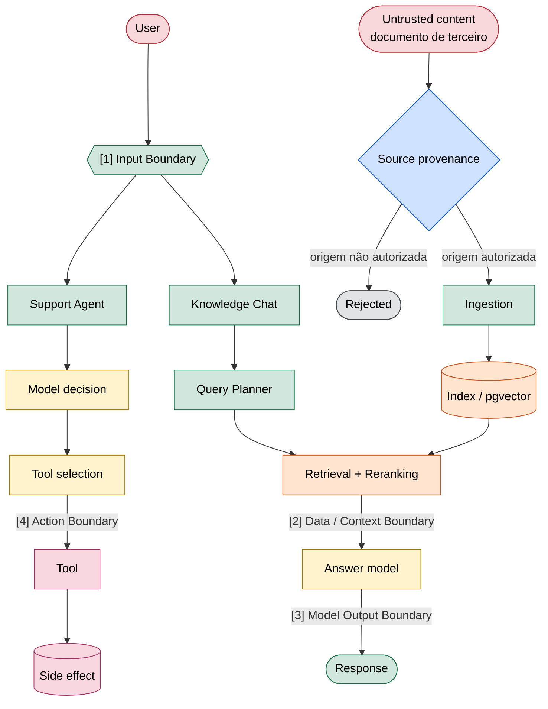
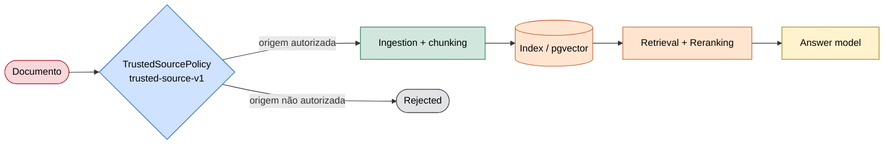
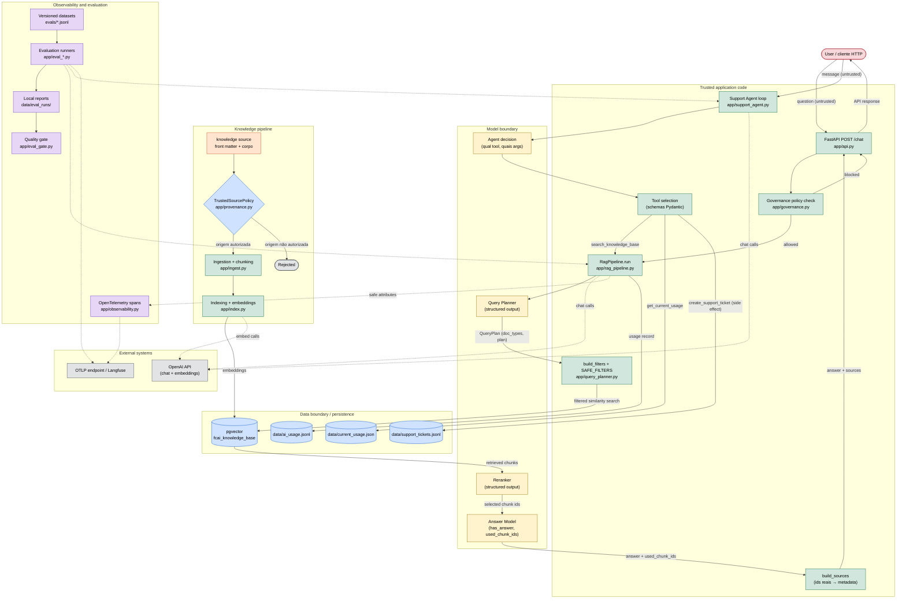
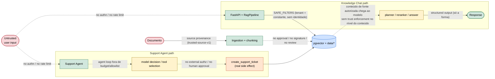

# Threat model de segurança

Este documento modela o **RAG Knowledge Chat** e o **Support Triage Agent** que vive sobre
ele: a arquitetura, seus assets, as trust boundaries que os dados e as decisões atravessam,
as attack surfaces expostas, os threat scenarios aplicáveis, os controles implementados e o
risco que permanece depois deles.

É uma descrição do **estado atual do sistema**. Cada risco tem um ID estável (SEC-001 a
SEC-014), um status, os controles que hoje o endereçam e o risco residual desses controles.

Referências de cobertura, usadas como vocabulário comum de risco e não como checklist a
cumprir: **OWASP GenAI LLM Top 10 2026** (LLM01–LLM10) e **OWASP Top 10 for Agentic
Applications 2026** (ASI01–ASI10).

Convenções deste documento:

- **Fato** é algo verificável no código; **risco** é uma consequência possível. As duas
  coisas são marcadas quando podem se confundir.
- Um controle que existe **pela metade** é registrado como parcial, com seu limite descrito,
  e não como ausente.
- `mitigated` nunca significa "resolvido": vem sempre com o risco residual escrito, porque
  um controle fecha um caminho, não uma classe inteira.
- Segredo de system prompt, structured output, filtro de metadata e "rede interna" não são
  tratados como mecanismos de autorização. São defesas úteis; não são autenticação.

## Architecture security overview

Esta é a visão simplificada da arquitetura: o mínimo para enxergar por onde o fluxo passa e
onde a confiança muda. O Mermaid detalhado e as seções abaixo são a referência completa.

A arquitetura tem **três principais attack paths**, e eles se separam por *onde a entrada
não confiável nasce*. Dois nascem no usuário e se dividem depois da Input Boundary — o
Knowledge Chat e o Support Agent — porque as capabilities disponíveis depois dela são
diferentes. O terceiro **não passa pelo usuário**: nasce num documento e entra pela
ingestão.

```
User     → Knowledge Chat → Response
User     → Support Agent  → Tool → Side effect
Document → Provenance / Ingestion → Retrieval → Model → Response
```



**Duas setas vermelhas entram no diagrama, não uma.** A pergunta do usuário atravessa a
Input Boundary; o documento atravessa a Data / Context Boundary. As duas terminam no mesmo
lugar — o contexto do modelo — e só a primeira é normalmente tratada como "entrada".

### Source provenance

A `TrustedSourcePolicy` (`app/provenance.py`, política `trusted-source-v1`) verifica se a
**origem** de um documento está autorizada antes da indexação — portanto antes do retrieval,
antes do reranker e antes do modelo.



A decisão não olha o conteúdo e não procura payload conhecido. Ela responde **uma** pergunta:
*esta origem está autorizada a fornecer conhecimento para este pipeline?* A allowlist de
source roots é controlada pela aplicação, e a resolução de caminho usa `Path.resolve()`
seguido de containment real — `../`, symlink apontando para fora de uma raiz autorizada e
diretório irmão com nome parecido não passam. Um documento pode ser estruturalmente válido
e ainda assim ser recusado: **valid document ≠ authorized source**.

**Residual:** `source trusted != content trusted`. A política responde sobre a origem, não
sobre o conteúdo. Uma origem autorizada ainda pode conter conteúdo malicioso, ser
comprometida ou carregar texto copiado de fora.

### Como ler este diagrama

**Attack surface** — ponto exposto em que uma entrada, conteúdo, chamada ou capability
controlável externamente consegue interagir com o sistema. Onde nada de fora influencia a
próxima etapa, não há superfície.

**Trust boundary** — ponto em que dados ou decisões atravessam níveis diferentes de
confiança, isto é, onde algo menos confiável passa a alimentar algo mais confiável. As
quatro setas numeradas acima são exatamente esses pontos.

**Capability** — o que se torna possível depois de uma boundary: recuperar documentos,
produzir texto, escolher uma tool, escrever em disco. A boundary importa na proporção das
capabilities que existem depois dela.

**Blast radius** — o alcance do dano quando uma boundary falha. Uma mesma categoria de
entrada não confiável tem blast radius diferente conforme as capabilities disponíveis: no
**Knowledge Chat** a entrada influencia principalmente **informação e resposta**; no
**Support Agent** a mesma categoria de entrada influencia **decisão, ferramentas, argumentos
e side effects persistidos**.

**Nem toda entrada adversarial vem do usuário.** Em sistemas com RAG, o conteúdo recuperado
também atravessa uma trust boundary antes de chegar ao modelo. A pergunta pode ser
perfeitamente legítima e o conteúdo adversarial chegar pelo documento — e nesse caso nenhum
guardrail sobre a entrada do usuário chega perto dele.

Três leituras que valem para o resto do documento:

- **Dado dentro do banco não é automaticamente confiável para o modelo.** Um chunk no
  `pgvector` é conteúdo de terceiro; colocá-lo no contexto é uma decisão, não um passo neutro.
- **Saída do modelo não é automaticamente confiável para a aplicação.** Structured output
  garante a forma, não a verdade.
- **Decisão do agente não é automaticamente autorização para executar uma ação.** Escolher
  uma tool e ter permissão de rodá-la são coisas diferentes.

Quatro distinções usadas como vocabulário:

| Não é a mesma coisa que | | |
| --- | --- | --- |
| `valid metadata` | ≠ | `provenance` — `status: published` é uma frase escrita **dentro** do arquivo recebido, não prova de que uma fonte autorizada publicou aquilo. |
| `trusted source` | ≠ | `trusted content` — origem autorizada não implica conteúdo seguro. |
| `grounding` | ≠ | `trusted grounding` — uma resposta pode citar fonte real e verificável, e essa fonte não ser autorizada. |
| `source exists` | ≠ | `source is authorized` — existir no índice é uma afirmação sobre o banco, não sobre permissão. |

### Quatro boundaries

| Boundary | Exemplo no projeto | Pergunta de segurança |
| --- | --- | --- |
| Input Boundary | User → Knowledge Chat / Support Agent | Uma entrada não confiável consegue alterar tarefa, decisão ou escopo? |
| Data / Context Boundary | documentos / pgvector → LLM | O conteúdo fornecido ao modelo vem de uma origem autorizada, e pode ser tratado com o nível de confiança adequado? |
| Model Output Boundary | LLM → aplicação | A aplicação está tratando output do modelo como dado não confiável? |
| Action Boundary | decisão do agente → execução da tool | Uma decisão do modelo é suficiente para autorizar uma ação? |

Estas quatro categorias são propositalmente grosseiras. As **12 trust boundaries detalhadas**
mais abaixo são especializações delas: `User → FastAPI` e `User → Support Agent` são o Input
Boundary; `Vector Store → Model Context` é o Data / Context Boundary; `Model Output →
Application` é o Model Output Boundary; `Agent Decision → Tool Execution` é o Action Boundary.

## Legenda das zonas de confiança

| Categoria | O que é |
| --- | --- |
| **Untrusted input** | Entrada controlada pelo usuário ou por outra fonte externa. |
| **Trusted application code** | Execução determinística escrita pela aplicação. |
| **Model output / decision** | Texto gerado ou escolha feita por um modelo. |
| **Retrieved content** | Conteúdo trazido de fora do modelo (chunks do vector store, documentos da base). |
| **Persistence** | Estado gravado em disco ou banco. |
| **External system** | Serviço fora do processo (OpenAI, backend OTLP/Langfuse). |
| **Observability & evaluation** | Telemetria, datasets, relatórios e o quality gate. |

## Fluxo principal do sistema



As fronteiras de confiança mais importantes são onde as zonas se tocam:

- **User → APP**: linha vermelha→verde. Tudo que entra é não confiável.
- **Knowledge source → KB pipeline**: a política de origem decide antes de qualquer chunk
  existir.
- **APP → Model boundary**: verde→amarelo. A aplicação delega uma decisão ao modelo.
- **Model boundary → APP**: amarelo→verde. A aplicação consome texto/decisão do modelo.
- **Data boundary → Model boundary**: chunks recuperados entram no contexto do modelo. É
  onde conteúdo de documento vira entrada do modelo.
- **Model decision → Data boundary**: `create_support_ticket` transforma uma escolha do
  modelo em escrita em disco.
- **APP → External**: OpenAI e o endpoint OTLP/Langfuse recebem dados que saem do processo.

## Assets

Cada asset é algo que, se lido, alterado ou forjado por quem não deveria, causa dano.

| Asset | Por que importa |
| --- | --- |
| **User input** (`question`, `message`) | Entrada não confiável; alcança planner, reranker, answer e a decisão do agente. É o vetor de prompt injection direto e de manipulação do planner. |
| **System prompts e instruções internas** | Definem o comportamento esperado do planner, reranker, answerer e agente. O segredo deles **não** é o controle: um prompt vazado não deve derrubar a segurança. |
| **Documentos da knowledge base** | Fonte de toda resposta do Knowledge Chat. Seu conteúdo entra no contexto do modelo; texto malicioso ali é injeção indireta. |
| **Document metadata** (`tenant`, `product`, `status`, `plan`, `doc_type`, `visibility`, `version`) | **Fornecida pelo documento.** Governa o que o retrieval devolve. Quem escreve o documento escreve esses rótulos, então eles descrevem o conteúdo — nunca provam autorização. |
| **Provenance metadata** (`provenance_trusted`, `provenance_source`, `provenance_policy`) | **Atribuída pela aplicação**, nunca lida do front matter. Registra a decisão de origem. Um documento que tenta declarar qualquer um destes campos é recusado. |
| **Embeddings e vector store** (`pgvector`) | Cópia derivada dos documentos, consultada por similaridade. Um chunk indexado é conteúdo que será servido ao modelo como verdade. |
| **Trusted source roots** (allowlist de `app/provenance.py`) | Definem quais origens podem fornecer conhecimento. Alterá-las amplia o que o sistema considera confiável. |
| **Tenant identity e tenant scope** | `tenant` é uma constante da aplicação (`SAFE_FILTERS`), não a identidade autenticada de uma requisição. É o eixo de isolamento que não existe de fato. |
| **Respostas produzidas** | O que volta ao usuário. Podem conter informação sensível recuperada, ou conteúdo vindo de um documento. |
| **Live usage data** (`data/current_usage.json`) | Números de consumo de um tenant, expostos pela tool `get_current_usage`. |
| **Support tickets** (`data/support_tickets.jsonl`) | Efeito colateral real: uma decisão do modelo vira registro persistido. Criação indevida é ação não autorizada. |
| **Tool arguments** (`severity`, `summary`, `tenant_id`, `question`) | Preenchidos pelo modelo. Determinam o que a tool faz — inclusive em qual tenant escreve. |
| **Traces** (spans OTLP/Langfuse) | Cópia secundária de metadados de operação. Se contiverem conteúdo, viram um segundo lugar onde dado sensível vaza. |
| **Evaluation datasets** (`evals/*.jsonl`) | Definem o que "certo" significa. Um dataset adulterado move a barra sem que ninguém perceba. |
| **Evaluation reports** (`data/eval_runs/`) | Insumo do quality gate. Um relatório forjado faz o gate aprovar um build que deveria reprovar. |
| **Credentials e configuration secrets** (`.env`) | Acesso ao provedor de modelo, ao banco e ao backend de observabilidade. Vazamento é comprometimento direto. |

## Trust boundaries

Para cada fronteira: o que atravessa, quem controla os dados, a confiança esperada, os
controles existentes e o risco residual.

### 1. User → FastAPI
- **Atravessa:** `question`, flags `debug` e `use_rerank` (`app/api.py`).
- **Controla os dados:** o usuário (não confiável).
- **Confiança esperada:** nenhuma.
- **Controles atuais:** validação de forma pelo Pydantic (`ChatRequest`); rejeição de
  pergunta vazia (HTTP 400); erros do pipeline viram HTTP 500 genérico sem stack trace.
- **Risco residual:** não há autenticação nem rate limiting; qualquer requisição entra.
  `debug=true` liga o payload de debug na resposta (ver fronteira 6).

### 2. User → Query Planner
- **Atravessa:** o texto da pergunta, embutido no prompt do planner.
- **Controla os dados:** o usuário.
- **Confiança esperada:** nenhuma — é entrada não confiável dentro de um prompt.
- **Controles atuais:** o planner só produz um `QueryPlan` tipado (`doc_types`, `plan`,
  `exact_terms`, flags). O schema **não** contém `tenant`/`product`/`status`, então o modelo
  não consegue emitir esses filtros. `doc_types`/`plan` só **estreitam** dentro do escopo
  fixo de `SAFE_FILTERS`.
- **Risco residual:** o usuário pode direcionar `doc_types`/`plan` para forçar ou suprimir um
  tipo de documento, ou tentar sequestrar o objetivo do planner. Não amplia escopo além de
  `SAFE_FILTERS`, mas influencia o que é recuperado.

### 3. Knowledge source → Ingestion
- **Atravessa:** arquivos Markdown (front matter + corpo) submetidos à ingestão.
- **Controla os dados:** quem tem escrita numa source root autorizada.
- **Confiança esperada:** nenhuma antes da decisão de origem; confiável quanto à *origem*
  depois dela.
- **Controles atuais:** `trusted-source-v1` (`app/provenance.py`) decide, antes de indexar,
  se a origem está autorizada — allowlist de source roots, path resolvido, containment real
  em vez de prefixo de string. `REQUIRED_METADATA` obriga presença dos campos (validação
  **estrutural**, mantida separada da decisão de confiança). `document_hash` cobre o arquivo
  inteiro. Provenance metadata é atribuída pela aplicação; documento que tenta declará-la é
  recusado.
- **Risco residual:** a procedência é verificada apenas como *origem no filesystem*. Não há
  assinatura, aprovação nem revisão: quem consegue escrever dentro de uma source autorizada é
  confiável por construção, e instruções embutidas no corpo de um documento autorizado
  continuam entrando no contexto (SEC-002). `document_hash` prova integridade após a leitura,
  não autoria.

### 4. Ingestion → Vector Store
- **Atravessa:** chunks (texto + `chunk_id` determinístico + metadata) e seus embeddings.
- **Controla os dados:** a aplicação (chunking) sobre conteúdo de documento autorizado.
- **Confiança esperada:** confiável quanto ao formato e à origem; **não** quanto ao conteúdo.
- **Controles atuais:** `chunk_id` determinístico evita duplicação; `index.py` recusa chunk
  sem `content`, `chunk_id`, `source_file` ou `document_hash`, e recusa chunk sem
  `provenance_trusted`; reindexação incremental por hash.
- **Risco residual:** a checagem de `provenance_trusted` no indexador detecta um arquivo de
  chunks desatualizado, mas **não é uma fronteira de autorização** — a marca é dado num
  arquivo local, e quem escreve o arquivo escreve a marca. A decisão real acontece sobre o
  caminho, antes de existir chunk. O context header (título, tipo, plano, versão) é prepended
  ao texto do chunk e embarca no embedding: metadata declarada vira parte do conteúdo
  recuperável, e nada valida se ela corresponde à realidade.

### 5. Vector Store → Model Context
- **Atravessa:** os chunks recuperados, formatados como contexto do prompt de resposta.
- **Controla os dados:** o conteúdo do documento, filtrado pela aplicação.
- **Confiança esperada:** os chunks são **dados**, mas chegam ao modelo como texto — a
  fronteira dado/instrução é porosa por natureza no LLM.
- **Controles atuais:** só chunks de origem autorizada existem no índice; `SAFE_FILTERS` fixa
  `tenant`/`product`/`status=published`; `build_filters` sempre parte de `SAFE_FILTERS`;
  system prompt manda usar "ONLY the context" e citar `chunk_id`; `used_chunk_ids` é validado
  contra os ids realmente presentes.
- **Risco residual:** um chunk de origem autorizada com instruções é lido pelo modelo como
  parte do contexto. O prompt pede para não obedecer, mas isso é mitigação por instrução, não
  uma barreira. Não existe separação determinística entre dado e instrução dentro do contexto.

### 6. Model Output → Application
- **Atravessa:** `RagAnswer` (`answer`, `has_answer`, `used_chunk_ids`), `RerankResult`,
  `QueryPlan`, e o payload de `debug` quando pedido.
- **Controla os dados:** o modelo.
- **Confiança esperada:** baixa — é texto gerado.
- **Controles atuais:** structured output com Pydantic garante **forma**, não verdade.
  `build_sources` só devolve fontes cujos `chunk_id` estavam mesmo no contexto (a fonte vem
  da aplicação, não do modelo). `NO_ANSWER` quando não há suporte.
- **Risco residual:** o campo `answer` é texto livre repassado ao cliente sem sanitização.
  Structured output valida tipos, não conteúdo — não é autorização nem garantia de fidelidade.

### 7. User → Support Agent
- **Atravessa:** a `message` do usuário, que alimenta o loop do agente.
- **Controla os dados:** o usuário.
- **Confiança esperada:** nenhuma.
- **Controles atuais:** system prompt define quando usar cada tool; `SupportAgentResult`
  estruturado. O loop do agente **não** passa pela governança (`check_policy`): allowlist de
  modelo e budget não são aplicados ao raciocínio/uso de tools do agente.
- **Risco residual:** a mensagem pode induzir o agente a escolher uma tool que produz efeito
  (`create_support_ticket`) ou a ler usage de forma indevida.

### 8. Agent Decision → Tool Execution
- **Atravessa:** o nome da tool escolhida e seus argumentos.
- **Controla os dados:** o modelo (decisão + argumentos).
- **Confiança esperada:** baixa — é uma decisão do modelo virando ação.
- **Controles atuais:** schema das tools (`@tool` + type hints); `severity` é
  `Literal["P1","P2","P3"]` (Pydantic rejeita valor fora do enum antes da função); `summary`
  vazio volta como erro-dado; tools retornam erro como dado, não exceção.
- **Risco residual:** não há camada externa de autorização nem aprovação humana entre a
  decisão e a execução. Uma escolha errada executa direto: `create_support_ticket` escreve em
  disco sem checagem além do schema, e `tenant_id` é um argumento livre do modelo.

### 9. Tool Output → Agent Context
- **Atravessa:** o retorno das tools (JSON de usage, resultado da criação de ticket, saída do
  RAG via `search_knowledge_base`) de volta ao contexto do agente.
- **Controla os dados:** a aplicação e — via `search_knowledge_base` — os documentos
  recuperados.
- **Confiança esperada:** mista: dados locais são confiáveis quanto à origem; a saída do RAG
  carrega conteúdo de documento.
- **Controles atuais:** `search_knowledge_base` devolve só `answer` + fontes, sem
  prompts/chunks/debug. `get_current_usage` valida `tenant_id` e recusa desconhecido.
- **Risco residual:** conteúdo de documento pode retornar pelo RAG e reentrar no contexto do
  agente (context poisoning encadeado), influenciando a próxima decisão de tool.

### 10. Application → OpenTelemetry
- **Atravessa:** spans com atributos seguros (ids, contagens, flags, filtros, timings,
  tokens); question/answer só como debug events.
- **Controla os dados:** a aplicação.
- **Confiança esperada:** confiável na origem, mas é uma **cópia secundária** dos dados.
- **Controles atuais:** só atributos seguros; prompts, chunks, documentos, `API_KEY` e
  `DATABASE_URL` nunca são gravados; captura de conteúdo exige `development` **e**
  `OBSERVABILITY_CAPTURE_CONTENT=true`; `validate_observability_policy` recusa subir se a flag
  estiver ligada fora de dev.
- **Risco residual:** onde os traces param é decisão de deployment; estar "interno" não os
  torna seguros. Com a captura de conteúdo ligada, pergunta e resposta passam a viver também
  no backend.

### 11. Application/Evaluation → Langfuse
- **Atravessa:** traces (OTLP), e — nas avaliações — datasets, inputs, outputs, scores e
  experiments (SDK Langfuse).
- **Controla os dados:** a aplicação; nas avaliações, também os `expected_output` dos datasets.
- **Confiança esperada:** confiável na origem; canal e credenciais precisam ser protegidos.
- **Controles atuais:** credencial via header `Authorization: Basic`, com só nomes de header
  impressos, nunca valores. As avaliações são o único ponto que importa um SDK de backend; o
  tracing permanece neutro sobre OTLP.
- **Risco residual:** os datasets carregam inputs e respostas esperadas para o backend;
  conteúdo sensível colocado num caso de teste vaza junto.

### 12. Dataset → Evaluation Runner
- **Atravessa:** casos versionados (`evals/*.jsonl`) para o runner que roda pipeline/agente e
  pontua.
- **Controla os dados:** quem edita os arquivos de dataset (via repositório/PR).
- **Confiança esperada:** tratada como confiável, mas **um dataset não é fonte necessariamente
  confiável**.
- **Controles atuais:** validação por Pydantic: ids únicos, campos coerentes,
  `accepted_source_files` que existem, tools que existem em `SUPPORT_TOOLS`.
  `ensure_within_policy` evita rodar com budget estourado.
- **Risco residual:** a validação checa **estrutura**, não intenção. Editar um
  `expected_output` para casar com um comportamento pior passa na validação e rebaixa a barra
  silenciosamente.

## Attack surfaces

O OWASP aqui é etiqueta de cobertura, não explicação.

| Superfície | Entrada controlável | Impacto possível | Controles atuais | Risco residual | OWASP |
| --- | --- | --- | --- | --- | --- |
| **Direct prompt injection** | `question` / `message` | modelo ignora regras, responde fora do escopo | system prompt restritivo; structured output | instrução não é barreira; sem filtro de injeção | LLM01, ASI01 |
| **Jailbreak** | `question` / `message` | contornar recusa e política de resposta | prompts de recusa; `NO_ANSWER` | sem detecção de jailbreak | LLM01 |
| **Query planner manipulation** | `question` | forçar/suprimir `doc_types`/`plan`, degradar retrieval | `QueryPlan` tipado; planner não emite `tenant`/`product`/`status` | usuário ainda influencia o estreitamento dentro de `SAFE_FILTERS` | LLM01 |
| **Indirect prompt injection** | corpo de documentos autorizados | instruções embutidas em chunk recuperado | `trusted-source-v1` barra origem não autorizada; "use ONLY the context"; escopo fixo | fronteira dado/instrução porosa; sem neutralização de conteúdo de fonte autorizada | LLM01, ASI06 |
| **RAG poisoning** | documentos, `pgvector` | conteúdo falso vira resposta "com fonte" | `trusted-source-v1`: source provenance antes da indexação; provenance metadata da aplicação; retrieval filters; reranking | conteúdo malicioso vindo de source autorizada; compromised trusted source; malicious authorized publisher; factual poisoning dentro de fonte autorizada | LLM05, LLM09, ASI06 |
| **Document provenance** | origem do arquivo e front matter | documento não autorizado vira fonte recuperável | `TrustedSourcePolicy` / `trusted-source-v1`; provenance metadata não é lida do front matter | filesystem origin ≠ cryptographic authorship; sem aprovação/revisão; trusted source compromise | LLM04, LLM05 |
| **Cross-tenant retrieval** | (sem identidade de requisição) | vazar dados de outro tenant | `SAFE_FILTERS` fixa `tenant`/`product`/`status` | `tenant` é constante, não identidade autenticada; filtro de metadata ≠ autenticação | LLM09, LLM02 |
| **Hidden context exposure** | system prompt, context header, debug payload | expor estrutura interna ou trechos de contexto | debug só quando pedido; prompts fora dos traces | payload de debug devolve plano, filtros e previews a quem o solicitar | LLM08 |
| **Sensitive information disclosure** | documentos, `current_usage.json`, respostas | vazar PII/dados internos na resposta | escopo `status=published`; usage por tool dedicada | sem classificação/redação de dado sensível na saída | LLM02 |
| **Unsafe model output** | campo `answer`, `summary` | conteúdo perigoso repassado sem sanitização | structured output valida forma | `answer` é texto livre entregue ao cliente sem tratamento | LLM10 |
| **Tool misuse** | `message` → decisão do agente | usar a tool errada para a tarefa | system prompt com regra por tool; schemas | sem política externa de uso de tool | ASI02, LLM03 |
| **Excessive agency** | `message` | agente age além do necessário | prompt limita quando agir | nenhum limite forçado fora do prompt | LLM03, ASI01 |
| **Unauthorized tool execution** | decisão do agente | executar ação sem autorização | schema das tools | sem camada de autorização entre decisão e execução | ASI03, ASI02 |
| **Unsafe tool arguments** | `severity`, `summary`, `tenant_id` | argumentos indevidos (ex.: `tenant_id` de outro tenant) | `Literal` de severity; `summary` não vazio; erro como dado | `tenant_id` é argumento livre do modelo; sem binding com identidade | ASI02, LLM10 |
| **Sensitive telemetry** | spans / debug events | conteúdo sensível parar no backend de traces | só atributos seguros; captura só em dev + flag; policy validada | interno não é seguro; captura ligada expõe pergunta/resposta | LLM02, LLM08 |
| **Evaluation dataset poisoning** | `evals/*.jsonl` | rebaixar a barra editando expectativas | validação estrutural Pydantic | validação não checa intenção; dataset não é fonte confiável por si | LLM05 |
| **Unbounded model/tool usage** | volume de requisições/tool calls | custo/consumo sem teto | governança do pipeline (allowlist, budget, `max_tokens`) | agente não passa por `check_policy`; sem rate limit; sem teto de passos em runtime | LLM06, ASI08 |
| **Supply chain** | `requirements.txt`, modelos, SDKs | dependência comprometida no build/runtime | um pin necessário (`langchain-community==0.4.1`) | demais dependências sem pin/lock; sem verificação de integridade | LLM04, ASI04 |

## Threat scenarios

| Threat scenario | Entry point | Target | Potential impact | Related risks |
| --- | --- | --- | --- | --- |
| **Direct input manipulation** | `question` / `message` | planner, answer model, decisão do agente | resposta fora do escopo; tarefa trocada; tool indevida | SEC-001, SEC-009 |
| **Indirect prompt injection** | corpo de documento autorizado | contexto do modelo | comportamento ditado por conteúdo recuperado | SEC-002 |
| **Factual poisoning** | conteúdo de documento autorizado | resposta ao usuário | informação falsa apresentada com fonte | SEC-002, SEC-003 |
| **Unauthorized source ingestion** | arquivo fora das source roots | índice / vector store | conteúdo de terceiro vira fonte recuperável | SEC-003 |
| **Cross-tenant access** | `tenant_id` em tool args; ausência de identidade | dados e escrita por tenant | leitura ou escrita atravessando o limite de tenant | SEC-004 |
| **Unauthorized tool execution** | `message` → decisão do modelo | tools com efeito | ação executada sem autorização; ticket persistido | SEC-008, SEC-010 |
| **Sensitive data disclosure** | documentos, usage, debug payload, traces | resposta e telemetria | PII/dados internos expostos na saída ou num segundo sistema | SEC-005, SEC-006, SEC-011 |
| **Improper output handling** | `answer` / `summary` | consumidor downstream | conteúdo perigoso renderizado ou persistido sem escape | SEC-007 |
| **Evaluation dataset poisoning** | `evals/*.jsonl` | quality gate | build aprovado que deveria reprovar | SEC-012 |
| **Unbounded consumption** | volume de requisições e passos do agente | custo e disponibilidade | consumo sem teto; negação de serviço por esgotamento | SEC-014 |
| **Supply chain compromise** | dependências, SDKs, modelos externos | build e runtime | execução de código comprometido | SEC-013 |

## Current controls

Inventário do que existe no código. Para cada controle: o que ele garante e o que ele **não**
garante.

- **Trusted ingestion / source provenance** (`app/provenance.py`, `app/ingest.py`)
  *Control:* decide, antes da indexação, se a origem de um documento está autorizada —
  allowlist de source roots controlada pela aplicação, resolvida com `Path.resolve()` e
  containment real (`../`, symlink para fora e prefixo de nome não passam). Provenance
  metadata é atribuída pela aplicação; documento que tenta declará-la é recusado. Validação
  estrutural e decisão de confiança são fatos separados e reportados separadamente.
  *Limit:* responde "esta origem está autorizada?", não "este conteúdo é seguro?". Não há
  assinatura, aprovação humana nem revisão; quem escreve dentro de uma source autorizada é
  confiável por construção.
- **`SAFE_FILTERS` no retrieval** (`app/query_planner.py`)
  *Control:* `build_filters` sempre parte de `{"tenant":"fcai","product":"fcai-cloud",
  "status":"published"}`; o modelo só acrescenta `doc_type`/`plan`, que **estreitam**.
  *Limit:* `tenant` é uma constante da aplicação, não a identidade autenticada de uma
  requisição. Filtro de metadata não substitui autenticação.
- **`status=published` como escopo de busca**
  *Control:* só documentos publicados entram no escopo.
  *Limit:* `status` é declarado no front matter; quem escreve o documento escolhe o próprio
  rótulo. Não é um controle de confiança — a decisão de origem é que trata procedência.
- **Structured output com Pydantic**
  *Control:* `QueryPlan`, `RerankResult`, `RagAnswer`, `SupportAgentResult` garantem a forma
  da saída do modelo.
  *Limit:* valida **tipo**, não verdade nem autorização. Um `has_answer=true` bem-formado
  ainda pode estar errado.
- **Validação de parâmetros das tools** (`app/support_tools.py`)
  *Control:* `severity` é enum via `Literal`; `summary` vazio volta como erro-dado; erros são
  dados, não exceções.
  *Limit:* valida forma do argumento; não valida se a **ação** é autorizada, nem prende
  `tenant_id` a uma identidade.
- **Tool schemas**
  *Control:* `@tool` + type hints geram o schema que restringe os argumentos aceitos.
  *Limit:* restringe forma, não intenção nem quem pode chamar.
- **`NO_ANSWER` behavior** (`app/rag_pipeline.py`)
  *Control:* sem contexto suficiente, responde que não encontrou em vez de improvisar; sem
  chunk relevante, para antes do modelo de resposta.
  *Limit:* depende do modelo respeitar a instrução; não impede conteúdo que produza um
  contexto "convincente".
- **Model allowlist e budget** (`app/governance.py`)
  *Control:* `check_policy` barra modelo fora da allowlist ou mês acima do budget **antes** de
  tocar o modelo; ledger em `data/ai_usage.jsonl`.
  *Limit:* aplicado ao `RagPipeline`; o loop do Support Agent não passa por `check_policy`.
- **Max output tokens**
  *Control:* `max_tokens` do pipeline vem da policy; o agente usa `ai_max_output_tokens`.
  *Limit:* limita tamanho da resposta, não o número de chamadas nem de passos.
- **Observability policy por ambiente** (`app/observability.py`)
  *Control:* sampling por ambiente; `validate_observability_policy` recusa subir com captura
  de conteúdo fora de `development`; question/answer só como debug events, só em dev e só com
  `OBSERVABILITY_CAPTURE_CONTENT=true`; spans levam só atributos seguros, e `API_KEY` /
  `DATABASE_URL` nunca são gravados.
  *Limit:* é política de deployment; não protege o backend de traces em si. Com a captura
  ligada, cria uma cópia de pergunta/resposta no backend.
- **Evaluation infrastructure** (`evals/*.jsonl`, `app/eval_*.py`)
  *Control:* datasets versionados e revisados como código, validados por Pydantic (ids únicos,
  fontes existentes, tools existentes); evaluators determinísticos comparam a **trajetória**
  do agente (quais tools, em que ordem, com quais argumentos) e reprovam resposta certa por
  caminho errado; tools proibidas por caso são verificadas, e a criação de ticket é medida
  pelo efeito real, não pela autodeclaração do modelo.
  *Limit:* mede offline, sobre datasets; não bloqueia nada em runtime. A validação checa
  estrutura, não intenção.
- **Quality gates** (`app/eval_gate.py`)
  *Control:* transforma relatórios em pass/fail contra thresholds em `evals/quality_gates.json`;
  suites `required` reprovam se faltarem.
  *Limit:* lê relatórios já produzidos; confia na integridade de dataset e relatório.

## Open risks

IDs estáveis. `Likelihood` e `Impact` em low/medium/high, análise simples de propósito.
`Observed behavior` aparece apenas quando existe evidência concreta do comportamento; os
detalhes quantitativos ficam nos relatórios de security evaluation, não aqui.

### SEC-001 — Direct prompt injection

**Component:** `POST /chat` → `RagPipeline` (planner/reranker/answer); `app/support_agent.py`.
**Threat:** entrada adversarial direta do usuário altera o comportamento do Knowledge Chat ou
do Support Agent — sobrepondo instruções, trocando a tarefa ou influenciando a escolha de tool.
**Impact:** resposta fora do escopo ou da finalidade; no caminho do agente, decisão de tool
influenciada por texto.
**Likelihood:** high · **Impact:** medium (Knowledge Chat) / high (Support Agent, pelo blast
radius maior).
**Current controls:** system instructions; structured outputs; escopo de retrieval fixo
(`SAFE_FILTERS`); tool schemas.
**Observed behavior:** o Knowledge Chat apresenta task hijacking / off-task generation —
executa tarefas fora da finalidade quando o assunto está dentro do domínio. O Support Agent
apresenta goal hijacking e manipulação de tool.
**Residual risk:** instruções de prompt não constituem security boundary. `grounding` e
`source_integrity` não equivalem a `task_scope`: uma fonte real sustenta os fatos, não
autoriza a tarefa.
**Status:** open · **OWASP:** LLM01, ASI01

### SEC-002 — Indirect prompt injection via RAG

**Component:** documentos → `pgvector` → contexto do modelo (fronteiras 3–5).
**Threat:** conteúdo recuperado de uma source autorizada carrega instruções capazes de
influenciar o modelo. A pergunta do usuário pode ser inteiramente legítima.
**Impact:** o conteúdo de um documento dita o comportamento do modelo; resposta influenciada
e apresentada "com fonte".
**Likelihood:** medium · **Impact:** high
**Current controls:** `trusted-source-v1` impede que sources não autorizadas cheguem ao
índice; system prompt delimita o comportamento esperado; o reranker pode reduzir exposição
incidentalmente, ao descartar chunks por precisão.
**Residual risk:** compromisso de uma source autorizada; conteúdo malicioso publicado por um
publisher autorizado; conteúdo externo copiado para dentro de um documento confiável; e,
acima de tudo, **não existe separação determinística entre dado e instrução dentro do contexto
do modelo**. O reranker não é um controle de segurança: ele foi escrito para precisão e não
distingue confiança.
**Status:** open · **OWASP:** LLM01, LLM05, ASI06

### SEC-003 — Provenance da fonte na ingestão

**Component:** `app/provenance.py`, `app/ingest.py`, `app/index.py`.
**Threat:** um documento tenta entrar no corpus como fonte confiável apenas por metadata
declarada — front matter estruturalmente válido com `tenant`, `product` e `status` escolhidos
pelo próprio autor.
**Impact:** qualquer conteúdo com rótulo válido viraria "verdade" recuperável; é a base para
RAG poisoning.
**Likelihood:** medium · **Impact:** high
**Current controls:** `trusted-source-v1` — allowlist de source roots controlada pela
aplicação, decidida **antes da indexação**, com resolução de caminho segura (`Path.resolve()`
+ containment real, resistente a `../`, symlink para fora e prefixo de nome). Provenance
metadata (`provenance_trusted`, `provenance_source`, `provenance_policy`) é atribuída pela
aplicação e nunca lida do front matter; documento que tenta declará-la é recusado. Validação
estrutural permanece separada da decisão de confiança, de modo que "documento válido de origem
não autorizada" é uma saída distinta de "documento inválido".
**Residual risk:** compromisso de uma trusted source; publisher autorizado malicioso; ausência
de autenticidade criptográfica (origem no filesystem não é autoria); ausência de aprovação ou
revisão humana antes da indexação. A checagem de `provenance_trusted` no indexador detecta um
arquivo de chunks desatualizado, mas não é uma fronteira de autorização.
**Status:** mitigated — apenas para o caminho de ingestão controlado pela aplicação ·
**OWASP:** LLM04, LLM05

### SEC-004 — Autorização e tenant isolation

**Component:** `SAFE_FILTERS`, `POST /chat`, tools do agente.
**Threat:** o tenant scope não deriva de uma identidade autenticada. `tenant="fcai"` é
constante da aplicação, não há identidade na requisição, e `tenant_id` é argumento livre nas
tools.
**Impact:** não existe mecanismo que **imponha** isolamento; ao surgir um segundo tenant, ou
com `tenant_id` controlável, não há autorização protegendo os dados.
**Likelihood:** medium · **Impact:** high
**Current controls:** `SAFE_FILTERS` fixa o escopo de retrieval; `get_current_usage` recusa
tenant desconhecido.
**Observed behavior:** o agente já emitiu tool calls cross-tenant a partir de entrada
adversarial.
**Residual risk:** filtro de metadata não é autenticação; argumentos de tool não estão
amarrados a nenhuma identidade.
**Status:** open · **OWASP:** LLM09, LLM02, ASI03

### SEC-005 — Hidden context exposure

**Component:** payload de debug do `POST /chat`; context header embutido nos chunks; spans.
**Threat:** informação de sistema ou de contexto — query plan, filtros, previews de chunk,
estrutura interna — torna-se visível através de saída ou telemetria inadequada.
**Impact:** exposição de estrutura interna e de trechos de contexto a quem consome a API ou o
backend de traces.
**Likelihood:** low · **Impact:** medium
**Current controls:** o payload de debug é **development tooling** e só é produzido quando
explicitamente solicitado; prompts e chunks ficam fora dos traces normais; a captura de
conteúdo em telemetria exige ambiente `development` e flag explícita.
**Residual risk:** o mecanismo é opt-in por requisição e não por ambiente, então a decisão de
expô-lo é de deployment. O context header interno permanece embutido no texto do chunk e pode
aparecer em conteúdo recuperado.
**Status:** open · **OWASP:** LLM08

### SEC-006 — PII e sensitive information disclosure

**Component:** documentos, `data/current_usage.json`, respostas do chat e do agente.
**Threat:** dado sensível presente na base ou no usage é recuperado e devolvido sem
classificação ou redação.
**Impact:** vazamento de informação sensível na saída.
**Likelihood:** medium · **Impact:** medium
**Current controls:** escopo `status=published`; usage acessível só via tool dedicada com
validação de tenant.
**Residual risk:** não há classificação nem redação de dado sensível na saída; nada impede que
um documento autorizado contenha PII.
**Status:** open · **OWASP:** LLM02

### SEC-007 — Improper output handling

**Component:** campo `answer` (chat) e `answer`/`summary` (agente).
**Threat:** o texto gerado é repassado ao cliente e persistido sem sanitização; um consumidor
downstream pode renderizá-lo sem escapar.
**Impact:** conteúdo perigoso propagado (ex.: markup/script se exibido numa UI).
**Likelihood:** low · **Impact:** medium
**Current controls:** structured output valida forma; a API não renderiza HTML.
**Residual risk:** não existe contrato de saída nem escape definido para consumidores; o campo
de texto é livre.
**Status:** open · **OWASP:** LLM10

### SEC-008 — Tool authorization

**Component:** `Agent decision → Tool execution` (fronteira 8).
**Threat:** o agente escolhe e executa uma tool sem nenhuma camada de autorização entre a
decisão e a execução.
**Impact:** ação executada apenas porque o modelo a escolheu, incluindo escrita em disco.
**Likelihood:** medium · **Impact:** high
**Current controls:** schemas de tool; validação de argumentos; erro como dado.
**Observed behavior:** entrada adversarial já provocou tool calls não solicitadas, com side
effect persistido.
**Residual risk:** não há política nem allowlist de execução por contexto; a decisão do modelo
é, na prática, a autorização.
**Status:** open · **OWASP:** ASI02, ASI03, LLM03

### SEC-009 — Excessive agency do Support Agent

**Component:** `app/support_agent.py`.
**Threat:** o agente age além do necessário — abre ticket sem pedido claro, ou usa tool que a
tarefa não exige.
**Impact:** efeitos colaterais indesejados e consumo extra; blast radius maior que o da tarefa
pedida.
**Likelihood:** medium · **Impact:** medium
**Current controls:** system prompt limita quando agir; avaliação determinística de trajetória
e de tools proibidas, offline.
**Observed behavior:** entrada adversarial já levou o agente a executar ações além da tarefa
legítima, com side effect persistido.
**Residual risk:** não existe limite forçado fora do prompt — nem confirmação, nem teto de
passos em runtime.
**Status:** open · **OWASP:** LLM03, ASI01

### SEC-010 — Approval boundary para ações sensíveis

**Component:** `create_support_ticket` (efeito real em `data/support_tickets.jsonl`).
**Threat:** uma ação que muda o mundo é executada direto da decisão do modelo, sem aprovação
humana nem etapa de confirmação.
**Impact:** escrita persistida sem gate humano; difícil de reverter num cenário real.
**Likelihood:** medium · **Impact:** high
**Current controls:** validação de argumentos; a tool só é chamada quando o modelo decide.
**Observed behavior:** entrada adversarial já produziu tickets persistidos com argumentos
manipulados, sem nenhuma etapa de aprovação.
**Residual risk:** não há human-in-the-loop nem confirmação para ações com efeito.
**Status:** open · **OWASP:** ASI02, LLM03

### SEC-011 — Observability e cópias secundárias de dados

**Component:** spans OTLP, backend Langfuse, debug events.
**Threat:** a telemetria cria uma segunda cópia de metadados; com captura de conteúdo ligada,
pergunta e resposta passam a viver também no backend.
**Impact:** dado exposto num segundo sistema, fora do controle do processo.
**Likelihood:** low · **Impact:** medium
**Current controls:** só atributos seguros nos spans; captura de conteúdo restrita a
`development` + flag; `validate_observability_policy`; segredos nunca gravados.
**Residual risk:** retenção e acesso do backend estão fora do escopo da aplicação; "interno"
não é sinônimo de seguro.
**Status:** open · **OWASP:** LLM02, LLM08

### SEC-012 — Evaluation dataset integrity

**Component:** `evals/*.jsonl` → runners → quality gate.
**Threat:** um `expected_output` é editado para casar com um comportamento pior; passa na
validação estrutural e rebaixa a barra sem alarme.
**Impact:** o gate aprova um build que deveria reprovar; a métrica mente.
**Likelihood:** low · **Impact:** high
**Current controls:** validação Pydantic; versionamento em git; revisão de PR.
**Residual risk:** a validação checa estrutura, não intenção; o dataset é tratado como fonte
confiável por padrão.
**Status:** open · **OWASP:** LLM05

### SEC-013 — Supply chain

**Component:** `requirements.txt`, SDKs, modelos externos.
**Threat:** uma dependência não fixada é atualizada para uma versão comprometida; ou um
modelo/SDK externo introduz comportamento malicioso.
**Impact:** comprometimento em build ou runtime.
**Likelihood:** low · **Impact:** high
**Current controls:** um pin necessário (`langchain-community==0.4.1`).
**Residual risk:** demais dependências sem pin ou lockfile; sem verificação de integridade.
**Status:** open · **OWASP:** LLM04, ASI04

### SEC-014 — Unbounded consumption

**Component:** `POST /chat`, loop do agente, tool calls.
**Threat:** volume alto de requisições ou de passos de agente sem rate limit; o loop do agente
não passa por `check_policy`.
**Impact:** custo e consumo sem teto; possível negação de serviço por esgotamento.
**Likelihood:** medium · **Impact:** medium
**Current controls:** governança do pipeline (allowlist de modelo, budget mensal,
`max_tokens`).
**Residual risk:** o agente não passa pela governança; não há rate limiting na entrada nem
teto de passos em runtime.
**Status:** open · **OWASP:** LLM06, ASI08

## Security controls and residual gaps

Este diagrama mostra o estado atual das fronteiras: **linha sólida** onde existe um controle
imposto pela aplicação, **linha tracejada** onde permanece risco residual.



**Fronteiras impostas pela aplicação:** procedência da origem antes da indexação
(`trusted-source-v1`, SEC-003); `SAFE_FILTERS` fixa o escopo de retrieval; structured output
fixa a forma da saída do modelo; a governança limita modelo e budget do pipeline; a política de
observabilidade limita o que sai em telemetria.

**Riscos residuais (tracejado no diagrama):**

- autenticação e rate limiting na entrada (SEC-014);
- identidade autenticada por trás do `tenant` (SEC-004);
- aprovação/revisão humana e autenticidade criptográfica do documento antes da indexação
  (SEC-003 residual);
- conteúdo vindo de fonte autorizada chega ao modelo sem nenhuma imposição de confiança no
  **nível do conteúdo** — `trusted source != trusted content` (SEC-002);
- autorização externa e aprovação humana entre a decisão do agente e a execução da ação
  (SEC-008, SEC-010);
- governança aplicada também ao loop do agente (SEC-014).
